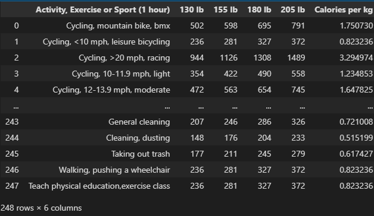
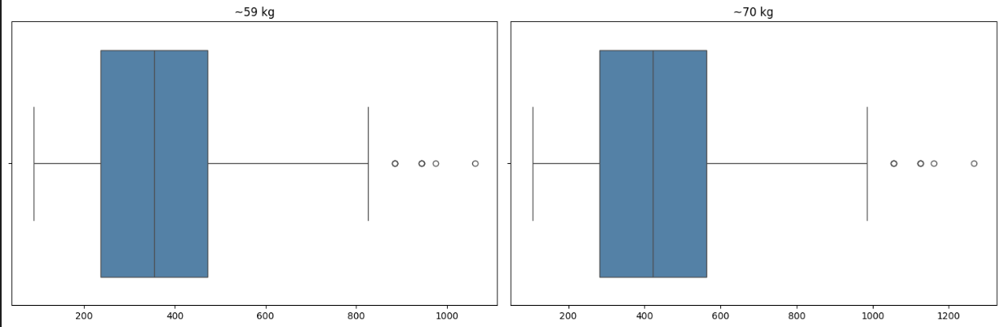
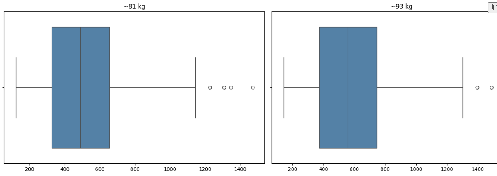
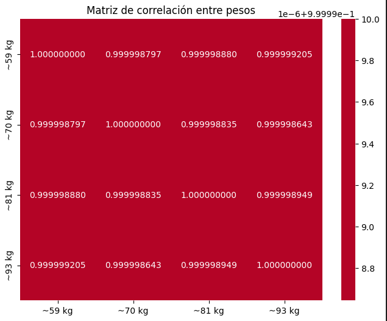
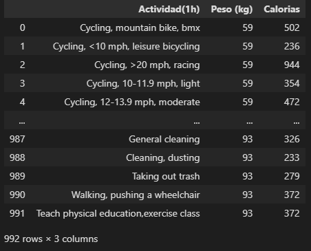
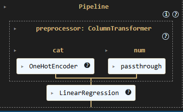
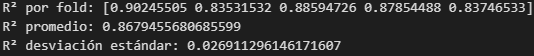
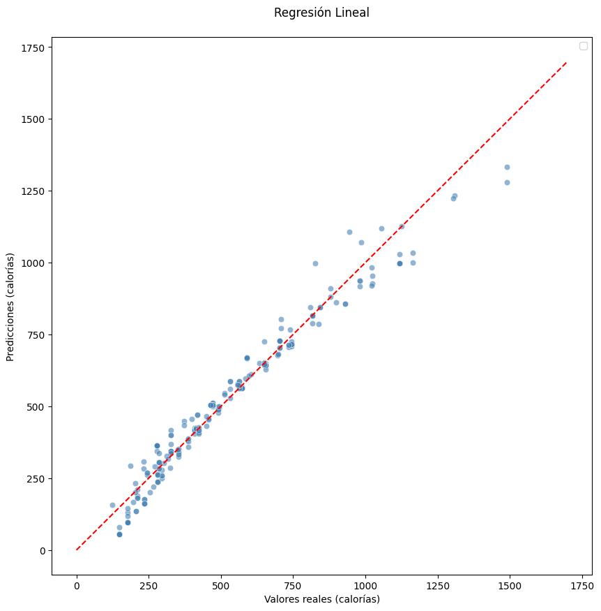
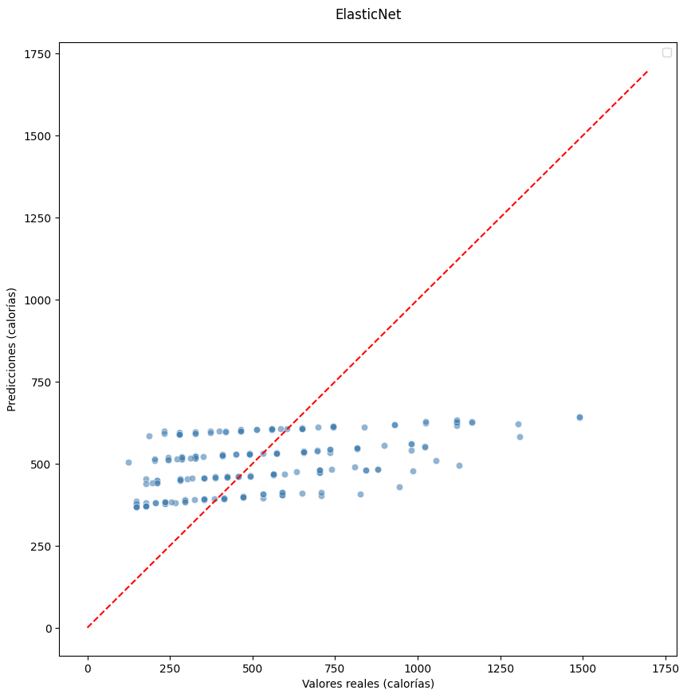

# Calories Burn Dataset

## Contexto

El ejercicio es definido como cualquier actividad fisica que esté estructurada que requiera un gasto energético. El hecho de mantenerse activo representa un pilar fundamental en el estilo de vida de las personas, conllevando numerosos benefifcios comprobados tanto para la salud mental como para el bienestar fisico. Como un amante del deporte, me interesa aprovechar esta oportunidad para entender a fondo el impacto real de nuestras decisiones en lo que decidimos realizar como deporte/entrenamiento. Con el propósito de que los resultados sean de utilidad práctica tanto para mi como para cualquier persona que desee mejorar su salud.

## Definición del Problema

A pesar de que existe una gran variedad de disciplinas disponibles, existe una falta de claridad sobre como varía el gasto energético real entre los ditintos tipos de esfuerzo. Por lo tanto, el problema central de este análisis consiste es poder determinar que actividades fisicas o ejercicios queman la mayor y menor cantidad de calorías por hora, y ver como esto influye en el peso corporal de cada individuo en el dicho deporte.

## Relevancia del Problema

Este problema posee un alto grado de relevancia debido a que permite a las personas optimizar su tiempo y esfuerzo, especialmente si tienen el objetivo concreto de perder peso. Cabe destacar que este análisis no se restringe al gusto personal por un deporte en específico, sino que evalúa de forma objetiva y cuantitativa el gasto calórico por hora. De este modo, los resultados actúan como una herramienta de decisión: el usuario puede identificar primero el grupo de actividades con mayor quema energética y, entre ellas, seleccionar la que mejor se adapte a sus preferencias personales.

#  Plan de Acción
## Descripción del Dataset
El dataset utilizado se denomina exercise_dataset.csv y contiene una amplia variedad de actividades físicas, puede ser encontrado en el siguiente enlace: [Calories Burned During Exercise and Activities](https://www.kaggle.com/datasets/aadhavvignesh/calories-burned-during-exercise-and-activities).

El cual se encuentra definido de la siguiente manera:

- Contiene un total de 248 registros y 6 columnas. Cada fila representa una actividad, ejerciico o deporte específico.
- La naturaleza de los datos nos presenta una combinación de datos cualitativos y cuantitativos.

### Variables Dataset

| Columna | Tipo de Dato | Descripción |
|-----------|-----------|-----------|
| Actividad, Ejercicio o Deporte  | Catégorico  | El nombre o descripción detallada de la actividad física |
| 130 lbs  | Numérico  | Calorías aproximadas quemadas por hora por una persona que pesa 130 libras (~59kg)  |
| 155 lbs  | Numérico | Calorías aproximadas quemadas por hora por una persona que pesa 155 libras (~70kg)  |
| 180 lbs  | Numérico  | Calorías aproximadas quemadas por hora por una persona que pesa 180 libras (~81kg)  |
| 205 lbs  | Numérico  | Calorías aproximadas quemadas por hora por una persona que pesa 205 libras (~93kg)  |
| Calorias por Kilo  | Numérico  | indica las calorías quemadas por hora por cada kilogramo de peso corporal. |

>  Para efectos de este análisis y con el fin de estandarizar los resultados a la forma que se mide en Chile el peso, se utilizará la variable kilogramos (kg).

## Modelo Seleccionado y Justificación
Se seleccionó un modelo de Regresión Lineal como herramienta predictiva. Esta elección se fundamenta en tres razones respaldadas en el análisis exploratorio de datos.

En primer lugar, los gráficos de dispersión realizados entre pares de variables del peso corporal, muestra que los puntos de distribuyen sobre una linea recta con pendiente positiva. Este comportamiento comprueba la hipotesis de que el gasto calórico escala proporcionalmente con el peso, además satisfaciendo los supuestos de la regresión lineal.

Como segundo punto, el análisis de correlación entre las cuatro variables de peso presentó una multicolinealidad severa, esto directamente descartó el uso de una Regresión Lineal Múltiple. Y se tuvo que reestructurar el dataset a un formato largo, donde el peso se convirtió en una fila como variable continua para que el modelo lograse interpretar correctamente.

En tercer lugar, el gasto energético ($E$) es directamente proporcional a la masa corporal ($m$) y al tiempo de trabajo ($t$). Dado que la relación entre el peso de una persona y las calorías que quema realizando una misma actividad es estrictamente lineal, por ello una Regresión Lineal al ser un modelo de baja varianza es lo que mejor funciona para este caso, sin necesidad de manejar modelos más complejos, evitando el overfitting. 

## Estrategia de Evaluación

Con el objetivo de evaluar el modelo mediante las métricas $R^2$, MAE, MSE y RMSE, los datos se separarán inicialmente en un conjunto de entrenamiento (80%) y uno de prueba (20%). Previo a la evaluación definitiva con el conjunto de prueba, se implementará una validación cruzada K-Fold (k=5) de manera exclusiva sobre los datos de entrenamiento, garantizando así una estimación más sólida y confiable sobre el rendimiento predictivo del modelo.

## Limitaciones del modelo en este contexto

El modelo asume que el gasto calórico se mantiene constante a lo largo del tiempo. Cosa que no es así, ya que en realidad factores como la fatiga humana alteran completamente la constancia de los resultados que están planteados. Además como segundo punto, el dataset no incorpora variables demográficas como el género, edad o condición de salud, las cuales influyen directamente en el gasto calórico. Por consecuencia, el modelo ofrece una aproximación simplificada de lo razonable a realizar, pero no captura la variabilidad de cada usuario.

## Metolodogía Aplicada (paso a paso)

La **primera etapa** consistió en el Análisis Exploratorio de Datos (EDA). Se cargó el dataset y se verificó su estructura, confirmando que tenia 248 ffilas y 6 columnas sin valores nulos ni duplicados, Ver **Imagen 1**.

Se renombraron las columnas para lograr estandarizar las unidades a kilogramos. Se aplicaron técnicas de estadística descriptiva, histograma, boxplots y gráficos de dispersión para lograr tener una visión clara de las variables y poder detectar anomalías. En este proceso se hizo un hallazgo crítico en la columna de Calorias por Kilo, visto en la **Imagen 2**.

Los valores reportados en el dataset estaban en calorias por libra en lugar de por kilogramo, producto de un error de conversión del autor del dataset. Para lograr convertirlo a kg se aplicó el factor de corrección 4.8602 (2 x peso de lb a kg), para así obtener resultados fisiologicamente más realistas. Quedando como la **Imagen 3**.

En particular el comportamiento de los boxplots de las cuatro columnas de peso, reveló un comportamiento característico: las cajas presentaban un tamaño y una proporción visualmente similares entre sí, se iba desplazando progresivamente hacia valores más altos mientras aumentaba el peso de referencia, Ver **Imagen 4 y 5**.

A partir de este hallazgo se puso asumar que las cuatro columnas presentarian una correlación casi perfecta ente sí, dado que representan el mismo gasto calorico medido a distintos pesos corporales. Dando la siguiente matriz de correlación, ver **Imagen 6**.

La confirmación de esta hipótesis, que arrojó valores superiores a 0.99 entre todos los pares de columnas de peso, me dió el siguiente hallazgo en poder justificar la necesidad de restructurar el dataset en un formato largo, donde las variables de peso aparecen como una única variable la cual es continua, así evitando la redudancia.

La **segunda etapa** consistió en el preprocesamiento de los datos, el cual inicialmente se tuvo que hacer la reestructuración del dataset de formato ancho a formato largo, mediante la operación data.melt. Generando un nuevo dataset de 992 filas (248 actividades por 4 pesos de referencia) con tres columnas (Ver **Imagen 7**):

La variable categórica Actividad fue codificada mediante One-Hot Encoding para lograr transformarla a numérica y ColumnTransformer para aplicarlo a la columna de Actividad, para así permitir su procesamiento por el modelo.

La **tercera etapa** correspondió al entrenamiento del modelo. Primeramente se construyó un Pipeline, que encadena el preprocesamiento y el modelo de Regresión Lineal(Ver **Imagen 8**). El dataset se dividió en 80% para entrenamiento y 20% para prueba, utilizando como random_state=42 para mantener la reproducibilidad. 

En la **cuarta etapa** correspondió a la evaluación del modelo, se aplicó inicialmente la validación cruzada 5-fold, evaluando exclusivamente sobre el conjunto de entrenamiento (80% de los datos). (Ver **Imagen 9**)

Al tener una comprobación de que el modelo es estable y generaliza de manera constante a través de distintas particiones del conjunto de entrenamiento. Se procedió a establecer el ajuste final con el 80 % de los datos reservados para el entrenamiento.

En paralelo se construyó un segundo pipeline con ElasticNet con el propósito de compara su desempeño frente al modelo de regresión lineal y evaluar si la regularización aporta o empeora en presencia de lo inicialmente evaluado que existe una multicolinealidad severa. Este pipeline fue entrenado y evaluado bajo las mismas condiciones que el modelo principal.

Finalmente, ambos modelos se evaluaron sobre el 20% de los datos restantes que correspondian a los datos de prueba, calculando las métricas de $R^2$, MAE, MSE y RMSE. Adicionalmente se generaron gráficos de dispersión en ambos modelos de las predicciones versus los valores reales para lograr ver como se comportaban.

Como **quinta etapa** se construyó una función donde se recibe de input la actividad, el peso y el tiempo disponible del usuario, retornando así las caloráis totales estimadas en la sesión. Se dejó dado el listado completo de actividades disponibles que dispone el dataset para facilitar el uso. 

# Resultados Obtenidos

### Gráfico de Dispersión: Regresión Lineal

### Gráfico de Dispersión: ElasticNet

## Métricas de Evaluación

| Métrica | Regresión Lineal | ElasticNet |
| :--- | :---: | :---: |
| **MSE**  | 2733.91 | 57405.87 |
| **RMSE**| 52.29 | 239.60 |
| **MAE**  | 37.26 | 187.86 |
| **$R^2$**  | **0.9622** | 0.2065 |

Al analizar el rendimiento de ambos modelos, se logra observar una diferencia drástica en sus resultados. El modelo de Regresión Lineal presenta un ajuste óptimo para el conjunto de datos. Con un $R^2$ de 0.9622, diciendo el modelo logra explicar el 96.22% de la variabilidad. Esto nos confirma la hipótesis inicial de que existe una relación sólida entre la masa corporal, la intensidad de la actividad y el gasto calórico total, el 3.78% restante son los valores atípicos que pueden interpretarse de deportes con un gasto calórico propio de un nivel de atleta.

Al contrastar este rendimiento con ElasticNet, se observa una superioridad brutal por parte del tradicional. En este escenario, la implementación de regularizadores hubiese sido una idea errónea, ya que desajusto las predicciones y se logró ver un notable underfitting. Esto se logra ver aún más evidente al evaluar el MSE de ambos modelos, dado que esta métrica penaliza severamente las desviaciones grandes, el valor de ElasticNet presenta una brecha enorme con el de Regresión  Lineal, debido a la considerable distancia que existe entre las predicciones y valores reales.

## Conclusiones

La elección de Regresión Lineal resultó ser la más adecuada a este problema, confimando la hipótesis inicial que se estableció en el EDA. El hallazgo más importante que se logró detectar fue el de unidades que sí bien el dataset se podía trabajar en libras cambiando solamente el nombre de la columna. Se optó por tranformar los valores a kilogramos par mantener el sistema de medición utilizado en Chile, esto me demostró la importancia que puede llegar a tener validar los datos durante la fase del EDA antes de proceder a armar el modelo.

El dataset presenta una limitación muy importante, el cual es que asume que el gasto calórico es constante, lo cual es falso en el mundo real. Este gasto no es constante ni lineal, cambia drásticamente según la disciplina.

Cada deporte tiene variables únicas que aquí se ignoraron. Por ejemplo un entramiento de fuerza tiene factores como el tiempo de descanso, IMC (Indice Masa Corporal), mientras que un deporte cardiovascular depende de la resistencia. Al meter todas estas variables en una misma tabla, el modelo se ve obligado a simplificar demasiado el problema.

Esto es posible utilizarlo por encima más que nada para identificar el comportamiento general de los datos, pero simplifica en exceso la realidad, perdiendo validez al momento de diseñar un plan real de entrenamiento o nutrición. Si se busca un valor práctico, lo correcto sería evaluar cada deporte por separado segmentando el conjunto de datos. Así pudiendo integrar las variables específicas de cada disciplina y lograr predicciones mucho más precisas y realistas.

#### Instalar Dependencias

>### 1. Crear el environment de Conda
>conda env create -f ambiente.yaml
>### 2. Activar el Environment
>conda activate Ejercicios